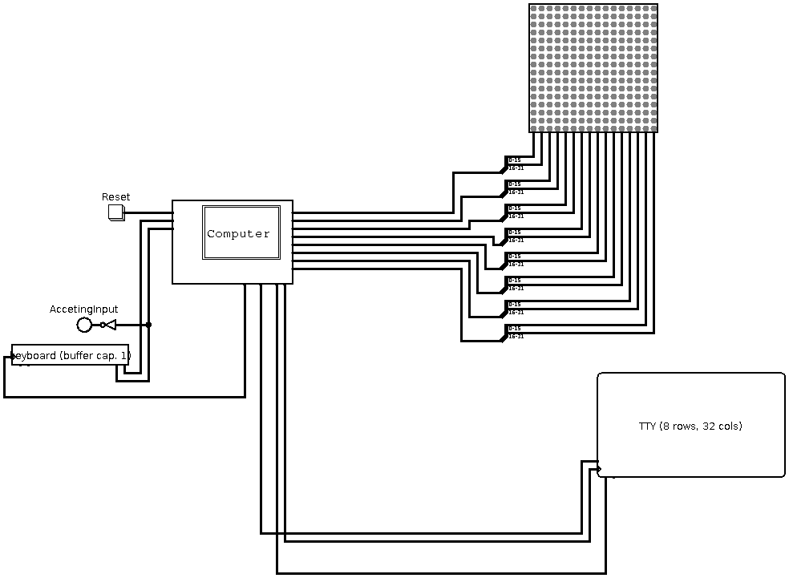
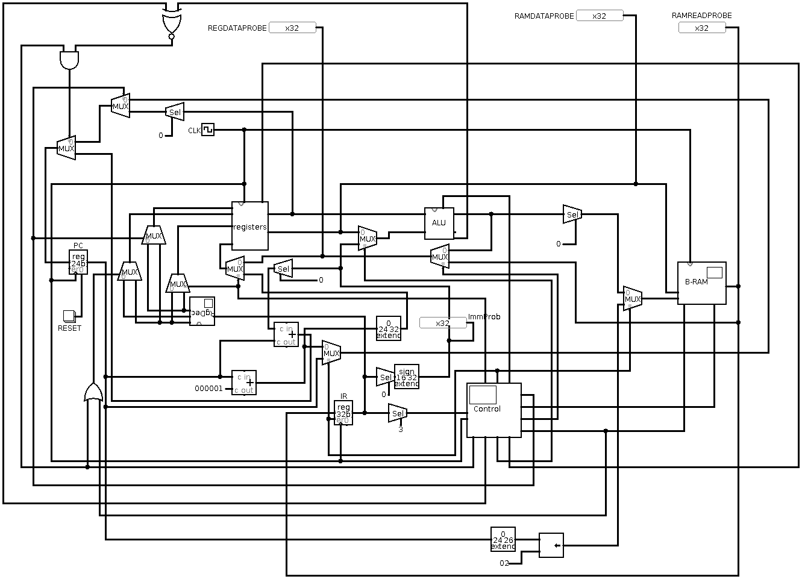
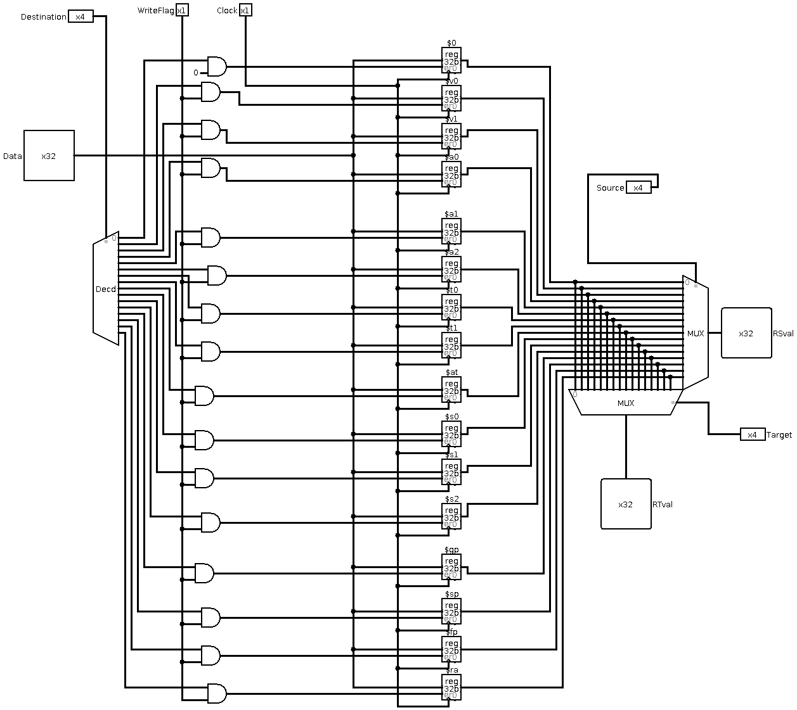
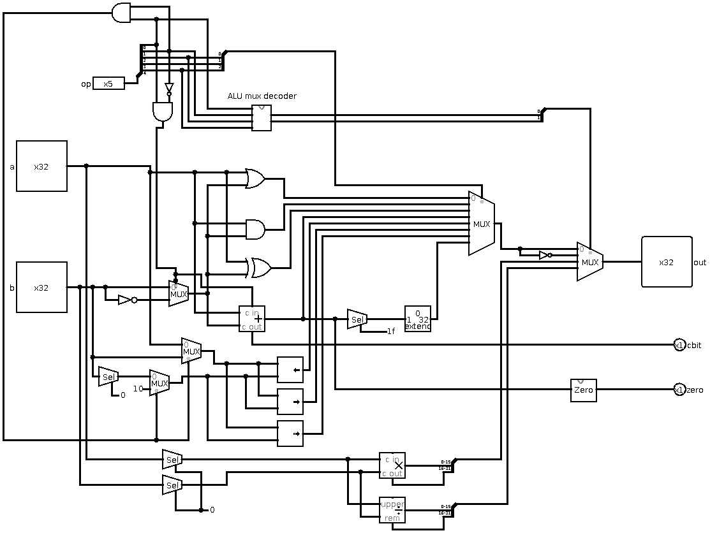

# myVM

NOTE: THIS PROJECT SUFFERS FROM MAJOR DOCUMENTATION BACKLOG.

In this project a virtual machine has been created through hardware virtualization using Logisim, a digital logic simulator software. An assembly language has also been designed for the VM.

This repository contains the VM Logisim file as well as an assembler for the VM. 

Note that this project is work in progress. 

# VM logisim architecture
The virtual machine system consists of a virtual computer and 3 IO devices. The IO devices are a logisim keyboard used for reading input, a logisim TTY to print characters, and a logisim led matrix. The virtual computer consists of a
CPU, RAM module, Interrupt Register, A built in timer, an address decoder for memory mapped IO, and interfaces for the 3 IO devices of the virtual system. The RAM module is shared instruction and data memory. 

Virtual machine systems top level user interface overview:

## Virtual Computer

## CPU
The CPU is a 32bit CPU. 

Below is an overview of the CPU and RAM module. At this point the RAM module and CPU or in a common circuit module.

### registers
The CPU consists of 16 32 bit registers. All registers can be read and written to. Which register to  read or write to is determined by the instruction registry decoder. The registry decoder decodes the RD (Destination Register) for writes, and the RS (Source register) and RT(Target register) for reads. 
The read RS and RT register value are output by the registers module. 

### ALU
The CPU consists of one 32bit ALU that can perform basic logic and arithmetic operations. All operations except for multiplication and division is a 32bit operations, the aforementioned operations are only support in 16 bits. The ALU takes in two 32bit inputs, performans an operation and outputs the result as a 32bit value. The ALU also outputs zero and carry flags. The zero flag is used for branch instructions. The carry flag has no use so far. The ALU takes in a 5 bit opcode value and what operation value is output by the ALU is determined by the opcode. 

Below is the effects of the two least significant bits of the ALU opcode:
| Effect                         | bit 2-4   | bit 0-1 |
|--------------------------------|-----------|---------|
| adder adds inputs(default)     | operation | 00      |
| adder subtracts inputs         | operation | 01      |
| operation result is inverted   | operation | 10      |
| mul and div results accessible | operation | 11      |

Below is the operation bits mapping when the two least significant bits arent both set:

| operation bits | gate output used as result |
|----------------|----------------------------|
| 000            | OR                         |
| 001            | AND                        |
| 010            | XOR                        |
| 011            | ADDER                      |
| 100            | SLL-gate                   |
| 101            | SRL-gate                   |
| 110            | SRA-gate                   |
| 111            | SLT-gate                   |

When both least significant bits are set: 

| operation bits | gate output used as result      |
|----------------|---------------------------------|
| 000            | mul-gate                        |
| 001            | dive gate                       |
| 010-011        | DONT CARE (undefined operation) |
| 100            | LUI logic                       |
| 101-111        | DONT CARE (undefined operation) |

# Assembly language 

Below is the register mapping: 

| Name | Number | Description                                                            |
|------|--------|------------------------------------------------------------------------|
| $0   | 0      | Zero register (recommended to always keep this register at constant 0) |
| $v0  | 1      | Return value register, put function return value in this register      |
| $v1  | 2      | *                                                                      |
| $a0  | 3      | Argument register, put arguments to function calls here                |
| $a1  | 4      | *                                                                      |
| $a2  | 5      | *                                                                      |
| $t0  | 6      | Temporary value register                                               |
| $t1  | 7      | *                                                                      |
| $at  | 8      | assembler temporary                                                    |
| $s0  | 9      | Saved temporary                                                        |
| $s1  | 10     | *                                                                      |
| $s2  | 11     | *                                                                      |
| $gp  | 12     | global pointer                                                         |
| $sp  | 13     | stack pointer                                                          |
| $fp  | 14     | frame pointer                                                          |
| $ra  | 15     | Return address, holds return address after function call               |

Note that these 16 registers are essentially general purpose, you can use them as you want but above is the standard way of using them. If you use them differently might've have to alter assembler or use no labels. 

R type instructions follow this format: 

| bits 24-31 | bits 20-23 | bits 16-19 | bits 12-15 | bits 0-11 |
|------------|------------|------------|------------|-----------|
| OPCODE     | RD         | RS         | RT         | DONT CARE |

Supported R type instructions:

| Operation | Opcode   | Notes/example                                                                                                      |
|-----------|----------|--------------------------------------------------------------------------------------------------------------------|
| OR        | 00000000 | OR $s0 $t0 $t1 <-> $s0_val = $t0_val bitwiseOR $t1_val                                                             |
| AND       | 00000001 |                                                                                                                    |
| XOR       | 00000010 |                                                                                                                    |
| NOR       | 00000011 |                                                                                                                    |
| NAND      | 00000100 |                                                                                                                    |
| ADD       | 00000101 |                                                                                                                    |
| SUB       | 00000110 | RD_val = RS_val - RT_val                                                                                           |
| SLL       | 00000111 | The shift by value is in RT register, note that it only uses 5 least significant bits in RT register               |
| SRL       | 00001000 | *                                                                                                                  |
| SRA       | 00001001 | *                                                                                                                  |
| SLT       | 00001010 | SLT $s2 $s1 $s0 <-> if $s1 < $s0 then 1 else 0                                                                     |
| XNOR      | 00001011 |                                                                                                                    |
| MUL       | 00001101 | Takes 16 least signifcant bits in RS_val and RT_val and multiplies, RD_val is resulting 32 bit product             |
| DIV       | 00001110 | Takes 16 least signifcant bits in RS_val and RT_val and divides, RD_val 16 LSb is Quotient and 16 MSb is Remainder |

I type instructions follow this format: 

| bits 24-31 | bits 20-23 | bits 16-19 | bits 0-15       |
|------------|------------|------------|-----------------|
| OPCODE     | RD         | RS         | Immediate value |

Supported I type instructions:

| Operation | Opcode      | Notes/examples                                                          |
|-----------|-------------|-------------------------------------------------------------------------|
| ORI       | 00010000    | ORI $s0 $t0 231 <-> $s0_val = $t0_val bitwise OR 231                    |
| ANDI      | 00010001    |                                                                         |
| XORI      | 00010010    |                                                                         |
| NORI      | 00010011    |                                                                         |
| NANDI     | 00010100    |                                                                         |
| ADDI      | 00010101    |                                                                         |
| SUBI      | 00010110    |                                                                         |
| SLLI      | 00010111    |                                                                         |
| SRLI      | 00011000    |                                                                         |
| SRAI      | 00011001    |                                                                         |
| SLTI      | 00011010    |                                                                         |
| XNORI     | 00011011    |                                                                         |
| MULI      | 00011101    |                                                                         |
| DIVI      | 00011110    |                                                                         |
| LB        | 00100101    | LB $s0 $t0 3 <-> Load the byte in mem_addr=$t0_val + 3 into $s0         |
| SB        | 00110101    | SB $s0 $t0 3 <-> Store byte in $s0 in mem_addr=$t0_val + 3              |
| LW        | 01000101    | LW $s0 $t0 8 <-> Load the word in mem_addr=$t0_val + 8 into $s0         |
| SW        | 01010101    | SW $s0 $t0 8 <-> Store word in $s0 in mem_addr=$t0_val + 8              |
| BEQ       | 10000110    | BEQ $s1 $s0 23 <-> if $s1_val == $s0_val then set PC = PC + Signext(23) |
| BNE       | 10010110    | BNE $s1 $s0 23 <-> if $s1_val != $s0_val then set PC = PC + Signext(23) |

Instructions that don't follow any of the above formats are called special instructions, there is 3 special instruction and they follow this format: 

| Special instruction | bits 24-31 | bits 20-23 | bits 16-19 | bits 0-15       |
|---------------------|------------|------------|------------|-----------------|
| JR                  | OPCODE     | RD         | DONT CARE  | DONT CARE       |
| JALR                | OPCODE     | RD         | RS         | DONT CARE       |
| LUI                 | OPCODE     | RD         | DONT CARE  | Immediate value |

Using special instructions: 

|Instruction| Opcode   | Notes/examples                                     |
|-----------|----------|----------------------------------------------------|
| JR        | 0110XXXX | JR $ra, PC = $ra_value                             |
| JALR      | 0111XXXX | JALR $s0 $ra, $ra_value = PC+1 then PC=$s0_val     |
| LUI       | 00011100 | LUI $s0 3931, set upper 16 bits of $s0_val to 3931 |

X is a don't care bit. 

Instructions supporting use of labels: 

|Instruction| Notes/examples                                                    |
|-----------|-------------------------------------------------------------------|
| J         | J label, PC = instruction_addr(label)                             |
| JAL       | JAL label, $ra_value = PC+1 then PC= instruction_addr(label)      |
| BEQL      | BEQL $s1 $s0 label <-> BEQ $s1 $s0 (instruction_addr(label) - PC) |
| BNEL      | BNEL $s1 $s0 label <-> BNE $s1 $s0 (instruction_addr(label) - PC) |

