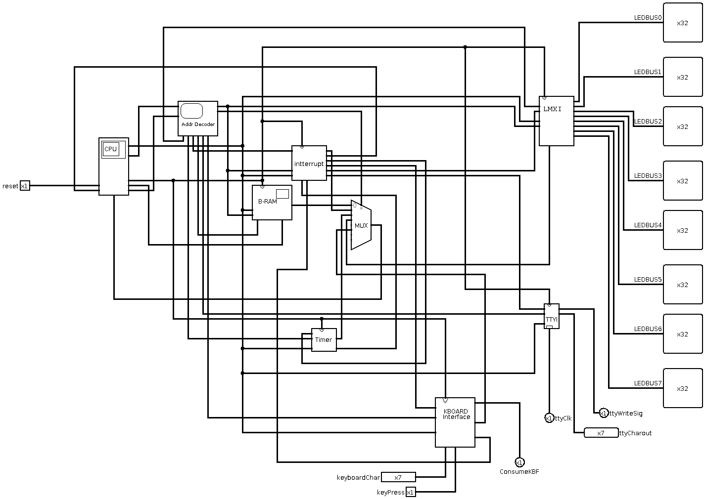

# myVM

In this project a virtual machine has been created through hardware virtualization using Logisim, a digital logic simulator software. An assembly language has also been designed for the VM.

This repository contains the VM Logisim file as well as an assembler for the VM. 

Note that this project is work in progress. 

# VM logisim architecture
The virtual machine system consists of a virtual computer and 3 IO devices. The IO devices are a logisim keyboard used for reading input, a logisim TTY to print characters, and a logisim led matrix. The virtual computer consists of a
CPU, RAM module, Interrupt Register, A built in timer, an address decoder for memory mapped IO, and interfaces for the 3 IO devices of the virtual system. The RAM module is shared instruction and data memory. 

Virtual machine systems top level user interface overview:

## Virtual Computer
The computer has memory mapped IO. So depending on the memory address used in load and store instructions different devices will be accessed, the 6 MSb of the memory address determines the device to access and the 26 LSb is a data address on the device. Note that not all devices have 2^26 addressable data segments, you need to know device specific valid memory addresses. 

All memory mapped IO devices except for the TTY interface supports both write and store operations, the TTY interface only supports write operations. 

The B-RAM module is the RAM module, it can perform read/write operations on a WORD/BYTE on a specifc memory address. The computer uses this RAM module as a shared instruction and data memory. 

The interrupt device is used for enabling/disabling the timer and IO interfaces, it also handles interrupt signals from the timer and keyboard interface and sends along the interrupt signal to the CPU if the devices are enabled. The only IO devices that can cause interrupts is the timer and keyboard interface. 

Below is an overview of the Virtual Computer. 

## CPU
The CPU is a 32bit CPU. 
The CPU has two stages, instruction fetch and instruction execution. In the instruction fetch stage the CPU fetches the next instruction at the memory address given by the Program Counter(PC) and stores it in the instruction register, this takes one clock cycle. The next stage is executing the fetched instruction, this takes one clock cycle as well. Thus to fetch and execute an instruction takes two clock cycles. 

Beside the ALU input registers the CPU also has special registers which are meant to be utilized for the purpose of CPU interrupt signal handling. You can set one of the special registers to the Interrupt service routine instruction memory address.
When an interrupt occurs PC is set to the ISR instruction memory address, the pre-interrupt PC is automatically saved in a special register. The ISR routine handles the interrupt and then resets the interrupt flag in the interrupt device, loads the pre interrupt PC into a register and jumps back to it resuming program execution. 

Below is an overview of the CPU module.

### registers
The CPU consists of 16 32 bit registers. All registers can be read and written to, except for the zero register which can only be read from. Which register to  read or write to is determined by the instruction registry decoder. The registry decoder decodes the RD (Destination Register) for writes, and the RS (Source register) and RT(Target register) for reads. 
The read RS and RT register value are output by the registers module. 

### ALU
The CPU consists of one 32bit ALU that can perform basic logic and arithmetic operations. All operations except for multiplication and division is a 32bit operations, the aforementioned operations are only supported in 16 bits. The ALU takes in two 32bit inputs, performans an operation and outputs the result as a 32bit value. The ALU also outputs zero and carry flags. The zero flag is used for branch instructions. The carry flag has no use so far. The ALU takes in a 5 bit opcode value and what operation value is output by the ALU is determined by the opcode. 

Below is the effects of the two least significant bits of the ALU opcode:
| Effect                         | bit 2-4   | bit 0-1 |
|--------------------------------|-----------|---------|
| adder adds inputs(default)     | operation | 00      |
| adder subtracts inputs         | operation | 01      |
| operation result is inverted   | operation | 10      |
| mul and div results accessible | operation | 11      |

Below is the operation bits mapping when the two least significant bits arent both set:

| operation bits | gate output used as result |
|----------------|----------------------------|
| 000            | OR                         |
| 001            | AND                        |
| 010            | XOR                        |
| 011            | ADDER                      |
| 100            | SLL-gate                   |
| 101            | SRL-gate                   |
| 110            | SRA-gate                   |
| 111            | SLT-gate                   |

When both least significant bits are set: 

| operation bits | gate output used as result      |
|----------------|---------------------------------|
| 000            | mul-gate                        |
| 001            | dive gate                       |
| 010-011        | DONT CARE (undefined operation) |
| 100            | LUI logic                       |
| 101-111        | DONT CARE (undefined operation) |

Below is an image of the ALU circuit.

# Assembly language 

Below is the register mapping: 

| Name | Number | Description                                                            |
|------|--------|------------------------------------------------------------------------|
| $0   | 0      | Zero register (read only, is always zerp)                              |
| $v0  | 1      | Return value register, put function return value in this register      |
| $v1  | 2      | *                                                                      |
| $a0  | 3      | Argument register, put arguments to function calls here                |
| $a1  | 4      | *                                                                      |
| $a2  | 5      | *                                                                      |
| $t0  | 6      | Temporary value register                                               |
| $t1  | 7      | *                                                                      |
| $at  | 8      | assembler temporary                                                    |
| $s0  | 9      | Saved temporary                                                        |
| $s1  | 10     | *                                                                      |
| $s2  | 11     | *                                                                      |
| $gp  | 12     | global pointer                                                         |
| $sp  | 13     | stack pointer                                                          |
| $fp  | 14     | frame pointer                                                          |
| $ra  | 15     | Return address, holds return address after function call               |

Note that these 16 registers ,except for the zero register, are essentially general purpose, you can use them as you want but above is the standard way of using them. If you use them differently might've have to alter assembler or use no labels. 

R type instructions follow this format: 

| bits 24-31 | bits 20-23 | bits 16-19 | bits 12-15 | bits 0-11 |
|------------|------------|------------|------------|-----------|
| OPCODE     | RD         | RS         | RT         | DONT CARE |

Supported R type instructions:

| Operation | Opcode   | Notes/example                                                                                                      |
|-----------|----------|--------------------------------------------------------------------------------------------------------------------|
| OR        | 00000000 | OR $s0 $t0 $t1 <-> $s0_val = $t0_val bitwiseOR $t1_val                                                             |
| AND       | 00000001 |                                                                                                                    |
| XOR       | 00000010 |                                                                                                                    |
| NOR       | 00000011 |                                                                                                                    |
| NAND      | 00000100 |                                                                                                                    |
| ADD       | 00000101 |                                                                                                                    |
| SUB       | 00000110 | RD_val = RS_val - RT_val                                                                                           |
| SLL       | 00000111 | The shift by value is in RT register, note that it only uses 5 least significant bits in RT register               |
| SRL       | 00001000 | *                                                                                                                  |
| SRA       | 00001001 | *                                                                                                                  |
| SLT       | 00001010 | SLT $s2 $s1 $s0 <-> if $s1 < $s0 then 1 else 0                                                                     |
| XNOR      | 00001011 |                                                                                                                    |
| MUL       | 00001101 | Takes 16 least signifcant bits in RS_val and RT_val and multiplies, RD_val is resulting 32 bit product             |
| DIV       | 00001110 | Takes 16 least signifcant bits in RS_val and RT_val and divides, RD_val 16 LSb is Quotient and 16 MSb is Remainder |

I type instructions follow this format: 

| bits 24-31 | bits 20-23 | bits 16-19 | bits 0-15       |
|------------|------------|------------|-----------------|
| OPCODE     | RD         | RS         | Immediate value |

Supported I type instructions:

| Operation | Opcode      | Notes/examples                                                          |
|-----------|-------------|-------------------------------------------------------------------------|
| ORI       | 00010000    | ORI $s0 $t0 231 <-> $s0_val = $t0_val bitwise OR 231                    |
| ANDI      | 00010001    |                                                                         |
| XORI      | 00010010    |                                                                         |
| NORI      | 00010011    |                                                                         |
| NANDI     | 00010100    |                                                                         |
| ADDI      | 00010101    |                                                                         |
| SUBI      | 00010110    |                                                                         |
| SLLI      | 00010111    |                                                                         |
| SRLI      | 00011000    |                                                                         |
| SRAI      | 00011001    |                                                                         |
| SLTI      | 00011010    |                                                                         |
| XNORI     | 00011011    |                                                                         |
| MULI      | 00011101    |                                                                         |
| DIVI      | 00011110    |                                                                         |
| LB        | 00100101    | LB $s0 $t0 3 <-> Load the byte in mem_addr=$t0_val + 3 into $s0         |
| SB        | 00110101    | SB $s0 $t0 3 <-> Store byte in $s0 in mem_addr=$t0_val + 3              |
| LW        | 01000101    | LW $s0 $t0 8 <-> Load the word in mem_addr=$t0_val + 8 into $s0         |
| SW        | 01010101    | SW $s0 $t0 8 <-> Store word in $s0 in mem_addr=$t0_val + 8              |
| BEQ       | 10000110    | BEQ $s1 $s0 23 <-> if $s1_val == $s0_val then set PC = PC + Signext(23) |
| BNE       | 10010110    | BNE $s1 $s0 23 <-> if $s1_val != $s0_val then set PC = PC + Signext(23) |

Instructions that don't follow any of the above formats are called special instructions, there is 3 special instruction and they follow this format: 

| Special instruction | bits 24-31 | bits 20-23 | bits 16-19 | bits 0-15       |
|---------------------|------------|------------|------------|-----------------|
| JR                  | OPCODE     | RD         | DONT CARE  | DONT CARE       |
| JALR                | OPCODE     | RD         | RS         | DONT CARE       |
| LUI                 | OPCODE     | RD         | DONT CARE  | Immediate value |

Using special instructions: 

|Instruction| Opcode   | Notes/examples                                     |
|-----------|----------|----------------------------------------------------|
| JR        | 0110XXXX | JR $ra, PC = $ra_value                             |
| JALR      | 0111XXXX | JALR $s0 $ra, $ra_value = PC+1 then PC=$s0_val     |
| LUI       | 00011100 | LUI $s0 3931, set upper 16 bits of $s0_val to 3931 |
| RSPEC     | 10100101 | RSPEC $s0 0, read special register 0 value into s0 |
| WEPC      | 10110101 | WEPC $s0, write value in $s0 into special EPC register|

X is a don't care bit. 

RSPEC is only valid for the immediate values 0 and 1 since there's only two special registers. 
For RSPEC and WEPC operations it is recommended to use the pseudo instructions equivalents instead. 

WEPC must be set to an ISR instructions address if CPU interrupts are expected. RSPEC instruction can used to read
pre interrupt PC.

Instructions supporting use of labels: 

|Instruction| Notes/examples                                                    |
|-----------|-------------------------------------------------------------------|
| J         | J label, PC = instruction_addr(label)                             |
| JAL       | JAL label, $ra_value = PC+1 then PC= instruction_addr(label)      |
| BEQL      | BEQL $s1 $s0 label <-> BEQ $s1 $s0 (instruction_addr(label) - PC) |
| BNEL      | BNEL $s1 $s0 label <-> BNE $s1 $s0 (instruction_addr(label) - PC) |
| WPCL      | WPCL label <-> WEPC = instruction_addr(label)| 

Supported pseudo instructions:

|Pseudo instruction | Notes/Examples |
|-------------------|----------------|
|NOP | Do nothing for once instruction cycle, evaluates to: SLL $0 $0 $0 |
|RPPC| reads value in pre-interrupt register, evaluates to: RSPEC $x 0 |
|REPC| reads value in ISR address register, evaluates to: RSPEC $x 1 |
|LI  | Loads an immediate 32bit value into a register, use: LI $x 32bit_immediate |

$x is an arbitrary register. 

# Memory mapped IO

|Device| Device address, 6 MSb of memory address| valid device address range, 26 LSb of memory address|
|------|----------------------------------------|-----------------------------------------------------|
|RAM| 0x0| 0x0 - 0x02000000 |
|Interrupt handler| 0x1 | DONT CARE, since the device only has one register
|Timer| 0x2| DONT CARE |
|Led matrix interface| 0x3| 0x0-0x7 |
|TTY interface | 0x4| DONT CARE|
|Keyboard interface| 0x5| DONT CARE |

# Device communications

## Interrupt handler

The interrupt handler allows enabling the timer, keyboard, matrix and TTY devices. It also handles interrupt signals from the timer and keyboard. It has one internal register which keeps track of enabled devices and interrupts, this register can be read and written too. The 2 LSB of the register is used for device enable/disable flags. The 2 MSB is used for device interrupt signals. Specific bitindexes are associated with specific devices.

Below is a table of register bitindexes for enable flags and their associated devices.
|bitIndex(Least significant to most significant)|Device enable/disable|
|--------|---------------------|
|0|Timer|
|1|Keyboard|
|2|Matrix|
|3|TTY|

To enable a device set the associated bitIndex, to disable a device clear the associated bitIndex. 

|bitIndex| Device interrupt flag |
|--------|-------------------------|
|16      | Timer interrupt flag |
|17      | Keyboard interrupt flag| 

On interrupts from devices these flags are set, and if the devices are enabled the interrupt signal is forwarded to the CPU.
To disable a device interrupt clear the associated bitindex. 

How to comminate with device in a nutshell: read data from the devices memory address into a register, perform neccesarry bit manipulations and write it back to the device. 

## Timer
To use the timer and to allow the timer device to cause CPU interrupts you need to first enable it from the interrupt handler device. 

The timer has one read/write configuration register (confReg) and one internal 28bit counter. The 28 LSb of confreg contains the value which when counter equals triggers a time-out, interrupt signal. Any write operations to confreg will automatically reset the internal counter. 

How timer delay is calculated:

$T_d = T_c/(Tick_{freq}/2)$ , where $T_d$ is timer delay, $T_c$ is 28 LSb of confReg, and $Tick_{freq}$ is the logisim simulator tickrate, in one tickrate one clock cycle phase transition occurs. 

When an interrupt occurs the MSb of confreg, interrupt flag, is set. To disable an interrupt and reset counter clear the MSb of confreq. 

Important: Set the 28 LSb of confreg to desired value first before enabling the device from the interrupt handler, otherwise it will cause an immediate interrupt.

## Keyboard device 
To use the keyboard device and allow it to cause CPU interrupts you need to enable it from the interrupt handler. 

When the device is enabled and a key press occurs, the byte associated to the character is saved in a register and can be read from the device as a 32 bit value where the LSB is the character byte ASCII value. To disable the device interrupt write to it with data were the LSb is set. 

## Led matrix interface
To use this device first enable it from the interrupt handler. This device does not cause interrupts. 

The Led matrix interface contains a 256 bit frame buffer for the led matrix, as well as a 256 pre-render buffer.

To write to the pre-render buffer then write to device memory addresses 0x0 to 0x7. Each of these addresses contain the pre-render buffer for a two column and 16 row LED segment in a 32bit register, the 2 LSB map to the first column from left to right on the LED matrix, and the 2 MSB map to the second column. The bottom row in a column maps to the least significant 16bit segment of the pre-render buffer. The LED matrix column addressing goes from left to right. 

To render, essentially write over the data from pre-buffer to frame buffer, write to the device with the device addresses 4th bit set. To clear the frame buffer, write to the device with the device addresses 5th bit set. This is a hacky way of controlling the device, but it does the job.

## TTY interface
To use this device first enable it from the interrupt handler. This device does not cause interrupts. This device supports write only, reading from it is undefined operation. 

Write the character you want to display on TTY. You write one character at a time, put the character byte in LSB of data before writing it to the device. 

This implementation is extremely basic and not ideal, a rework in the future is probable. 
