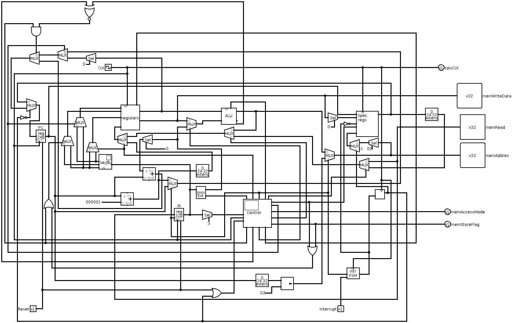

# myVM

In this project a virtual machine has been created through hardware virtualization using Logisim, a digital logic simulator software. An assembly language has also been designed for VM.

This repository contains the VM Logisim file as well as an assembler for the VM. 

# VM logisim architecture
The virtual machine so far consists of a CPU and a RAM module. The RAM module is a shared instruction and data memory. 

## CPU
The CPU is a 32bit CPU. 

Below is an overview of the CPU and RAM module. At this point the RAM module and CPU or in a common circuit module.

### registers
The CPU consists of 16 32 bit registers. All registers can be read and written to. Which register to  read or write to is determined by the instruction registry decoder. The registry decoder decodes the RD (Destination Register) for writes, and the RS (Source register) and RT(Target register) for reads. 
The read RS and RT register value are output by the registers module. 

### ALU
The CPU consists of one 32bit ALU that can perform basic logic and arithmetic operations. All operations except for multiplication and division is a 32bit operations, the aforementioned operations are only support in 16 bits. The ALU takes in two 32bit inputs, performans an operation and outputs the result as a 32bit value. The ALU also outputs zero and carry flags. The zero flag is used for branch instructions. The carry flag has no use so far. The ALU takes in a 5 bit opcode value and what operation value is output by the ALU is determined by the opcode. 

Below is the effects of the two least significant bits of the ALU opcode:
| Effect                         | bit 2-4   | bit 0-1 |
|--------------------------------|-----------|---------|
| adder adds inputs(default)     | operation | 00      |
| adder subtracts inputs         | operation | 01      |
| operation result is inverted   | operation | 10      |
| mul and div results accessible | operation | 11      |

Below is the operation bits mapping when the two least significant bits arent both set:

| operation bits | gate output used as result |
|----------------|----------------------------|
| 000            | OR                         |
| 001            | AND                        |
| 010            | XOR                        |
| 011            | ADDER                      |
| 100            | SLL-gate                   |
| 101            | SRL-gate                   |
| 110            | SRA-gate                   |
| 111            | SLT-gate                   |

When both least significant bits are set: 

| operation bits | gate output used as result      |
|----------------|---------------------------------|
| 000            | mul-gate                        |
| 001            | dive gate                       |
| 010-011        | DONT CARE (undefined operation) |
| 100            | LUI logic                       |
| 101-111        | DONT CARE (undefined operation) |

